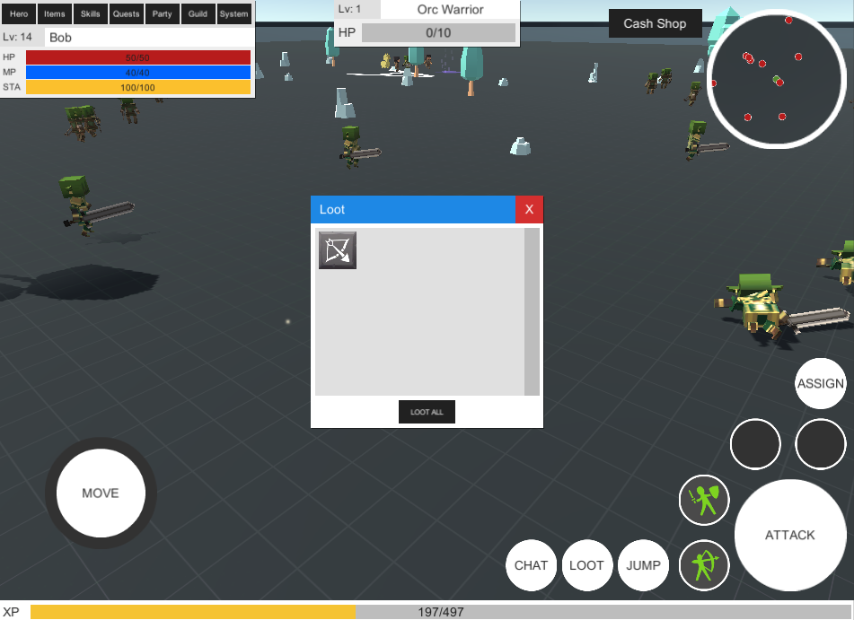
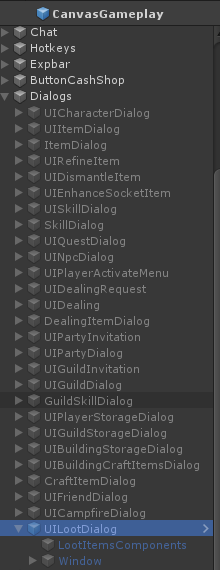
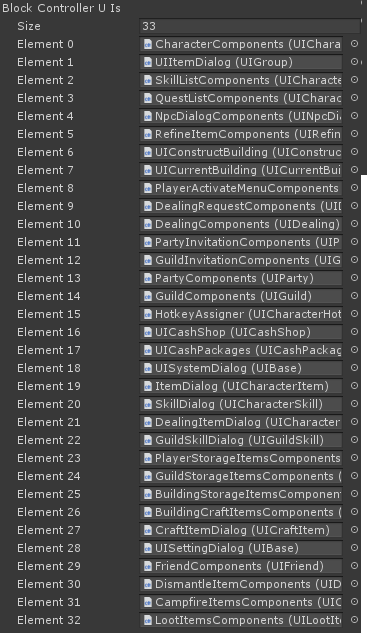
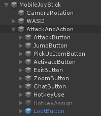
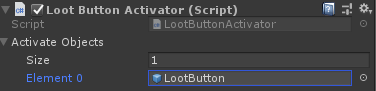
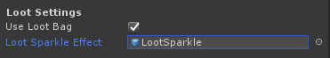
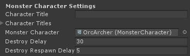

# UnityMultiplayerARPG_LootBag
LootBag add-on for SURIYUN's MMORPG Kit for Unity.

This add-on changes the loot system to drop loot into character loot bags on death, rather than dropping items directly to the ground.

## Installation instructions
1. Download and import add-on package from: https://github.com/vaughanb/UnityMultiplayerARPG_LootBag/releases

### CanvasGameplay Prefab
1. Open CanvasGameplay prefab. If you are using mobile, open CanvasGameplayMobile instead!

2. Add UILootDialog prefab from the add-on prefabs directory to Dialogs on CanvasGameplay.

3. Open CanvasGameplay in Inspector and add LootItemsComponents from the UILootDialog to the 'UI Loot Items' field under 'Loot Bag Addon'.

4. Scroll down to 'Block Controller Uis' and increase size by 1. Then add LootItemsComponents to the new element.

#### For mobile only: 
5. Add LootButton prefab to AttackAndAction object under MobileJoyStick in CanvasGameplayMobile.

6. Open CanvasGameplayMobile in inspector again and add the Loot Button Activator component. Then drag the LootButton object you added in the previous step to 'Activate Objects'.

### Monster Character Entities
1. Open any monsters you wish to have loot bags in the inspector. Under 'Loot Settings', make sure 'Use Loot Bag' is checked and drag the LootSparkle prefab to the 'Loot Sparkle Effect' field.

2. Scroll down to 'Monster Character Settings' and increase the 'Destroy Delay' setting to the length of time you wish monster bodies to remain and be lootable before de-spawning (at least 30 seconds recommended).

