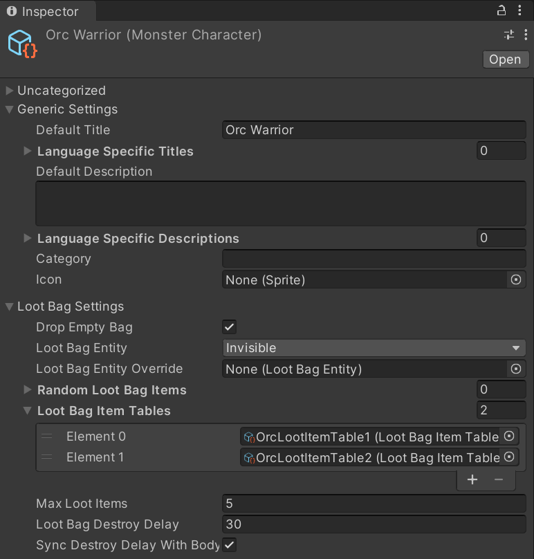

# UnityMultiplayerARPG_LootBag
LootBag add-on for SURIYUN's MMORPG Kit for Unity.

This add-on changes the loot system to drop loot into character loot bags on death, rather than dropping items directly to the ground. 

**Please note that this works on the 3D version of the kit only.**

## Installation instructions
For versions prior to 1.70, refer to instructions here: https://github.com/vaughanb/UnityMultiplayerARPG_LootBag/README-OLD.md

For version 1.70 and later:

Download and import add-on package from: https://github.com/vaughanb/UnityMultiplayerARPG_LootBag/releases

### CanvasGameplay Prefab
1. Open CanvasGameplay prefab. If you are using mobile, open CanvasGameplayMobile instead.

2. Replace UISceneGameplay script on CanvasGameplay with included UISceneGameplay_LootBag script. This can be done by selecting Debug mode at the top-right of the inspector. Then simply drag UISceneGameplay_LootBag.cs onto 'Script' where UISceneGameplay is currently. Then switch back to normal mode.

3. If you wish to have the loot dialog block the UI, select UILootBagStorageDialog in Resources/UI and add the 'Block UI Controller' component to it.

Necessary UI elements will be automatically added to UISceneGameplay at runtime.

### Monsters
1. Open any MonsterCharacter GameData files for monsters you with to have loot bags in the inspector. Under 'Loot Bag Settings' you will be presented with a number of options for loot bag behavior. By default, monsters use the invisible loot bag entity and other appropriate settings to simulate looting directly from the body. Feel free to change any of these settings as you see fit.

2. Add any items you wish for the monster to drop under 'Random Loot Bag Items' or add a Item Drop Table file to the 'Loot Bag Item Drop Table' field. Remove loot from the 'Random Items' section under 'Killing Rewards'. This version does not disable the default loot system, so any items in the normal loot section will drop the ground.

### Players
Player characters can also be configured to drop loot on death. To do this:

1. Open the PlayerCharacter GameData file. Under 'Loot Bag Settings'. Under 'Loot Bag Settings', select 'Use Loot Bag' and select either the Visible or Invisible loot bag entity from the list. For players, it is recommended to use the visible loot bag entity.

2. Under 'Random Loot Bag Items' you can add random loot items the same as for monsters OR select 'Drop All Player Items'.

